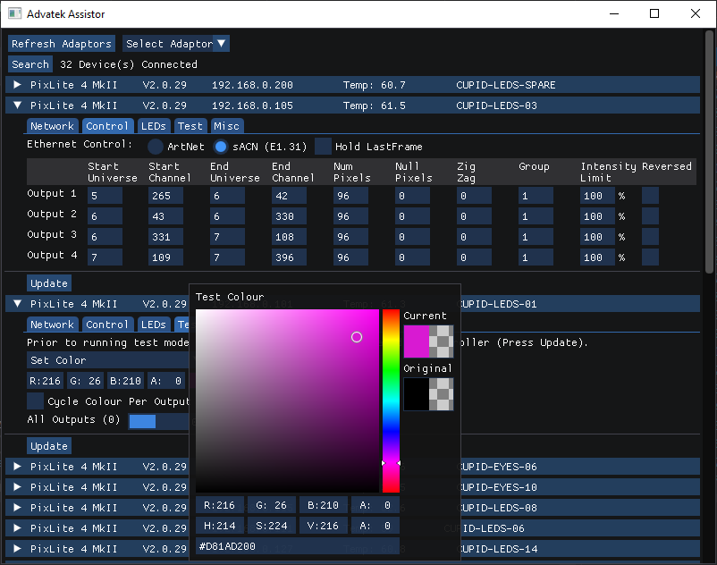

# Advatek Assisitor

## About

This is an Advatek Assistant clone that can run under Linux and adds the following features:

  - Works on Raspberry Pi
  - Saving and Loading of Advatek config settings to and from the controller in JSON format
  - Cycling of output channels in test mode
  - Cycling of output pixels in test mode

## Dependencies

  - [ImGui](https://github.com/ocornut/imgui) ([Interavctive Manual](https://pthom.github.io/imgui_manual_online/manual/imgui_manual.html))  
  - [Boost](https://github.com/boostorg/boost)  
  - [Portable File Dialogs](https://github.com/samhocevar/portable-file-dialogs)  

## Build
    
    git clone <this repo>
    git submodule update --init
    
    cd External/boost
    git submodule update --init

    ./bootstrap.sh or ./bootstrap.bat
    ./b2
    
    sudo apt-get install libglfw3-dev
    
    mkdir build && cd build
    
    cmake ../ 
    
    make -j6

 **For debugging on Raspberry Pi use GDB**

    cmake -DCMAKE_BUILD_TYPE=Debug ../
    
    make
    
    gdb ./advatek_assistor
`
## Run

After downloading a release on the Linux make it executable:

    Properties > Permissions > Execute > Anyone

> Adaptor selection does not work properly on the Raspberry Pi. Workaround is to Turn WiFi off or alternativly set it's prioraty with `sudo ifmetric wlan0 400` both will need to be reset to have internet conection back `sudo ifmetric wlan0 40`  :ok_hand:

