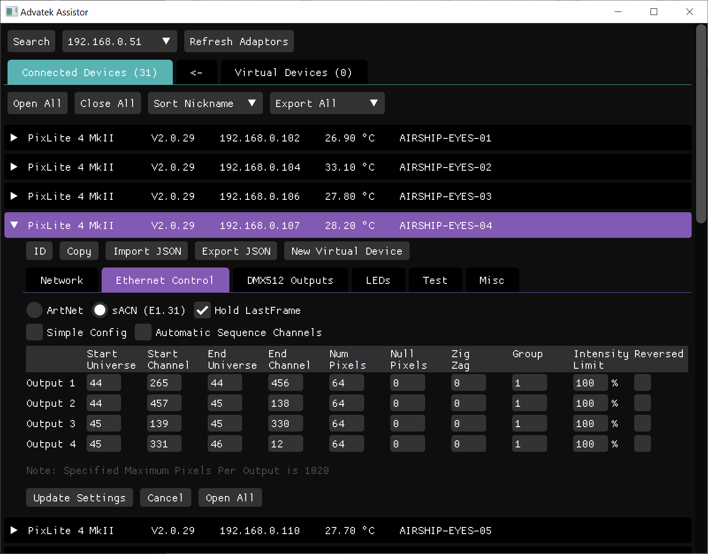

# Advatek Manager

## About

Advatek Manager is an [Advatek Assistent](https://www.advateklights.com/downloads/advatek-assistant) clone that allows you to easily configure and save your Advatek control devices. It will automatically list the Advatek devices on your network without knowing their IP address, making it easy to keep track of any size installation. It has the ability to detect devices with an address outside your computers IP range and save config settings of a complete installation to JSON format. This file can then be automatically uploaded onto an installation based on the connected controllers MAC, IP or Nickname.

  - Works and tested on Debian variants (Raspberry Pi / Ubuntu)
  - Save all controller settings to JSON format
  - Bulk Load/Upload Advatek config settings to devices
  - Cycling of output channels and or pixels in test mode

## Dependencies

  - [GLFW](https://github.com/glfw/glfw)
  - [ImGui](https://github.com/ocornut/imgui) ([Interactive Manual](https://pthom.github.io/imgui_manual_online/manual/imgui_manual.html))  
  - [Boost](https://github.com/boostorg/boost)  
  - [Portable File Dialogs](https://github.com/samhocevar/portable-file-dialogs)  
  - [libAdvatek](https://github.com/studioENESS/libAdvatek)  

## Download and Run

  1. Download and install the latest [release package](https://github.com/studioENESS/AdvatekManager/releases)
  2. run the executable:

    AdvatekManager

## Setup

    git clone https://github.com/studioENESS/AdvatekManager.git
    cd AdvatekManager && chmod u+x ./setup.sh && ./setup.sh

## Build
    
    cd build
    cmake ../
    make -j6

    
## Creating Debian/Ubuntu .deb package

Copy appplication file to `AdvatekManager_<major version>.<minor version>-<package revision>_<architecture>/usr/local/bin`

    dpkg-deb --build advatek_assistor_<major version>.<minor version>-<package revision>_<architecture>

